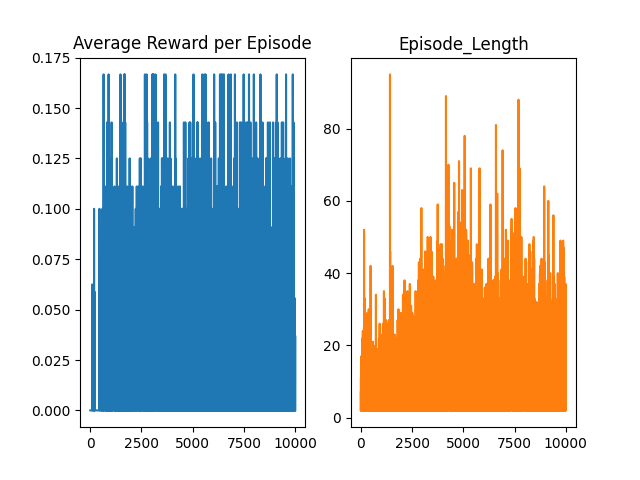
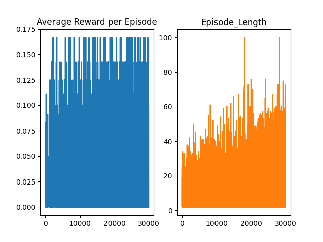

# FrozenLake 4x4 Reinforcement learning
## Frozen Lake description 

__state space__
```
SFFF       (S: starting point, safe)
FHFH       (F: frozen surface, safe)
FFFH       (H: hole, fall to your doom)
HFFG       (G: goal, where the frisbee is located)
```

__action space__
```
West(0), South(1), East(2), North(3) 
```

__reward function__
Game is finish when you reach goal or fall in hole. 
```
if you reach goal reward == 1
if you fall in hole reward == 0
if you step on frozen surface reward == 0
if you step on starting point reward == 0
```

## Algorithm pseudocodes
### Value iteration 


### Monte carlo 


#### Statistic after 30000 episodes:



### Q-learning

My implementation of algorithm use q-learning decay extension, 
so we initialize additionaly 
```
epsilon_decay (multiplying factor by which we decrease epsilon) 
epsilon_min (minimum value of epsilon)
```
and after every episode train
```
if epsilon >= epsilon_min {
  epsilon *= epsilon decay
}
```
#### Statistic after 30000 episodes:


