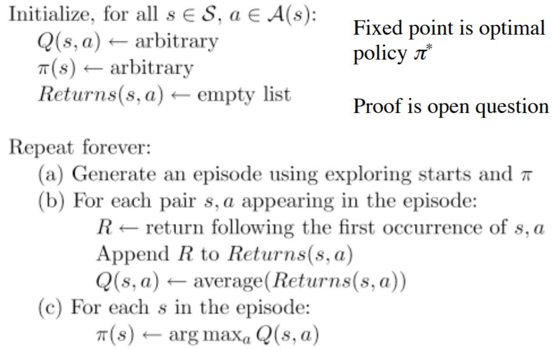
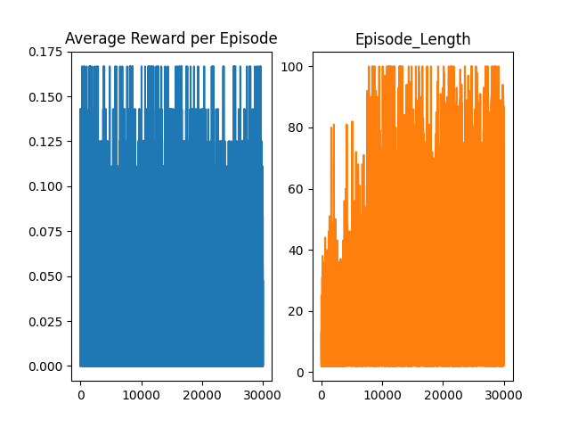
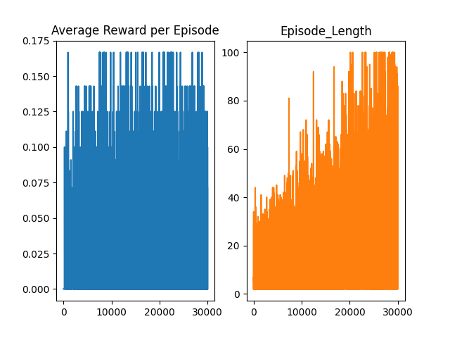

# FrozenLake 4x4 Reinforcement learning
## Frozen Lake description 

__state space__
```
SFFF       (S: starting point, safe)
FHFH       (F: frozen surface, safe)
FFFH       (H: hole, fall to your doom)
HFFG       (G: goal, where the frisbee is located)
```

__action space__
```
West(0), South(1), East(2), North(3) 
```

__reward function__
Game is finish when you reach goal or fall in a hole. 
```
if you reach goal reward == 1
if you fall in hole reward == 0
if you step on frozen surface reward == 0
if you step on starting point reward == 0
```


## Algorithm pseudocodes
### Value iteration 


#### Experiments

| Experiment No | Theta | Gamma | Win/Episodes |
|---------------|-------|-------|--------------|
|1|0.1|0.8|0.251|
|2|0.05|0.8|0.274|
|3|0.01|0.8|0.486|
|4|0.005|0.8|0.467|
|5|0.001|0.8|0.478|
|6|0.01|0.7|0.471|
|7|0.01|0.75|0.485|
|8|0.01|0.85|0.472|
|9|0.01|0.9|0.474|
|10|0.001|0.9|0.754|

> As we can see, 
> decreasing theta parameter and 
> increasing gamma gives best results.


(Each experiment is repeated 10 times and the best one is chosen)
All agents from the experiment are in the experiments folder
### Monte carlo 



#### Statistic after 10000 episodes:


#### Statistic after 30000 episodes:


#### Experiments
| Experiment No | Gamma | Epsilon | Explore episodes | Episode count | Best result | Average |
|---------------|-------|---------|------------------|---------------|-------------|---------|
|1|0.9|0.1|1000|10000|0.72|0.244|
|2|0.9|0.2|1000|10000|0.731|0.418|
|3|0.9|0.3|1000|10000|0.69|0.463|
|4|0.9|0.25|1000|10000|0.66|0.444|
|5|0.9|0.2|2000|10000|0.7|0.293|
|6|0.9|0.2|500|10000|0.73|0.543|
|7|0.8|0.2|500|10000|0.59|0.269|
|8|0.95|0.2|500|10000|0.745|0.504|
|9|0.97|0.2|500|10000|0.727|0.583|
|10|0.97|0.2|500|30000|0.745|0.660


(best result = win / count of episode) 
count of episode = 1000

> Increasing the gamma gives better results.
> Epsilon also, but not more than 0.2, because otherwise there will be too many random actions
> Too many episodes will decrease the optimality of the policy and increase the number of steps.
> Explore episode. They need a good balance so they don't have too many random actions (about 500-1000)


(Each experiment is repeated 10 times and the best one is chosen)
All agents from the experiment are in the experiments folder

### Q-learning

My implementation of algorithm use q-learning decay extension, so we initialize additional 
```
epsilon_decay (multiplying factor by which we decrease epsilon) 
epsilon_min (minimum value of epsilon)
```
and after every train_episode
```
if epsilon >= epsilon_min {
  epsilon *= epsilon decay
}
```

#### Statistic after 10000 episodes:


#### Statistic after 30000 episodes:


#### Experiments
| Experiment No | Gamma | Epsilon | Learning rate | E-min | E-decay | Episode count | Best result | Average |
|---------------|-------|---------|---------------|-------|---------|---------------|-------------|---------|
|1|0.8|0.2|0.1|0.01|0.99995|10000|0.531|0.270|
|2|0.9|0.2|0.1|0.01|0.99995|10000|0.709|0.426|
|3|0.95|0.2|0.1|0.01|0.99995|10000|0.746|0.555|
|4|0.98|0.2|0.1|0.01|0.99995|10000|0.763|0.683|
|5|0.98|1|0.1|0.01|0.99995|10000|0.771|0.721|
|6|0.98|1|0.1|0.01|0.99999|10000|0.765|0.652|
|7|0.98|1|0.1|0.01|0.9995|10000|0.762|0.746|
|8|0.98|1|0.2|0.01|0.9995|10000|0.756|0.741|
|9|0.98|1|0.3|0.01|0.9995|10000|0.754|0.712|
|10|0.98|1|0.05|0.01|0.9995|10000|0.755|0.740|
|11|0.98|1|0.1|0.01|0.99995|30000|0.763|0.740|


(best result = win / count of episode) 
count of episode = 1000

> The most important part is to find the right epsilon/e-min/e-decay 
> so that there are not too many, and not too little, random actions
> Maximizing Gamma -> gives best results
> Best learning rate  is ~0.1
> Too many episodes will decrease the optimality of the policy and increase the number of steps.


(Each experiment is repeated 10 times and the best one is chosen)
All agents from the experiment are in the experiments folder


## Comparison of algorithms
| Test | Value Iteration | Monte-Carlo | Q-Learning |
|------|-----------------|-------------|------------|
| Best Results | 0.754 | 0.745 | 0.771 |
| Time with best params (10k episodes for QL and MC) | 0.409 (0.732 wr) | 8.4367s (0.712 wr) | 2.5709s (0.722 wr)

wr = winrate

#### Info 
using Utils you can load agent (utils.read()). 